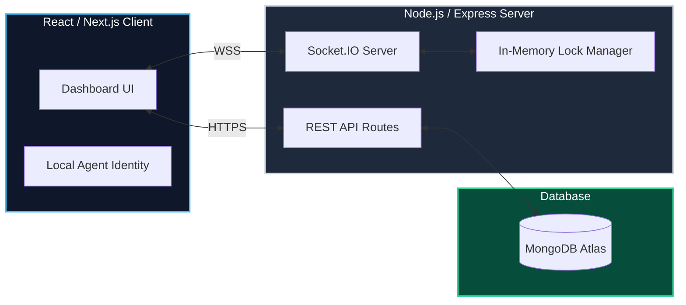

# 🚀 RapidOps Live

> A premium, real-time collaborative support helpdesk built for peak efficiency and seamless team coordination.

---

## ⚠️ Problem Statement
In fast-paced logistics and live-ops environments, customer support agents often step on each other's toes. Without real-time synchronization, two agents might try to open and resolve the same critical delivery ticket simultaneously. This leads to duplicated work, conflicting database updates, wasted time, and ultimately, a frustrating customer experience.

## 💡 Solution
**RapidOps Live** completely eliminates this issue by introducing a strict **Real-Time Ticket Locking Protocol**. When an agent clicks on a ticket, it instantly locks for all other agents across the network via WebSockets. The system features a live activity feed, instantaneous ticket synchronization, and a beautiful, expensive-feeling UI designed to maximize agent productivity and prevent concurrent state collisions.

---

## 🏗️ Build Architecture (HLD)

The system relies on a hybrid architecture: REST for standard CRUD operations, and Socket.IO for real-time state mutation and locking validation.

---

## ⚙️ Tech Stack

### 🎨 Frontend
* **Framework:** Next.js 16 (App Router)
* **Library:** React 19
* **Styling:** TailwindCSS v4 with Class-based Dark Mode
* **Real-time Client:** `socket.io-client`
* **Icons:** Lucide React

### 🛠️ Backend
* **Runtime:** Node.js (TypeScript)
* **Framework:** Express.js
* **Real-time Server:** Socket.IO
* **Validation:** Zod
* **Database Driver:** Mongoose

---

## 🔄 Project Flow & Working

1. 🕵️ **Agent Identity**: Upon visiting the app, the user selects their agent profile (e.g., Agent Ayush). This is persisted locally.
2. 📥 **Initial Sync**: The frontend fetches all existing tickets via the REST API (`GET /api/tickets`) and establishes a persistent WebSocket connection.
3. 🔒 **Real-Time Locking**:
   * When an agent attempts to edit a ticket, the UI emits a `lock_ticket` socket event.
   * The backend's `ticketLockService` validates the lock in memory. If successful, it broadcasts a `ticket_locked` event to all other connected clients.
   * Other agents immediately see a lock icon (e.g., 🔒 *Locked by Agent Ayush*) and the UI disables editing for them.
4. 📝 **Optimistic Updates & Activity**: Creating, saving, or unlocking a ticket triggers optimistic UI updates for the sender (making the app feel blazingly fast) while streaming the action directly to the global **Live Activity Feed** for all other users.
5. 👻 **Ghost Disconnect Handling**: If an agent closes their laptop or loses internet, the server automatically detects the Socket disconnect and safely releases all locks owned by that agent, preventing tickets from being stuck in a locked state forever.

---

## 📞 Connect with Me

Looking to collaborate, hire, or learn more about my work? Let's connect!

- 🌐 **Portfolio**: [alpha-portfolio-five.vercel.app](https://alpha-portfolio-five.vercel.app/)
- 💼 **LinkedIn**: [Ayush Ranjan](https://www.linkedin.com/in/ayush-ranjan-9135d3/)
- 🐙 **GitHub**: [ayush-ranjan9135](https://github.com/ayush-ranjan9135)
- 📸 **Instagram**: [@ayush.__.srivastava](https://www.instagram.com/ayush.__.srivastava?igsh=dW1zdHFjcTZnenV2)
- 📘 **Facebook**: [Ayush Ranjan](https://www.facebook.com/share/1AhB4q1WeW/)

---
*Built with ❤️ for Sprint 19.*
